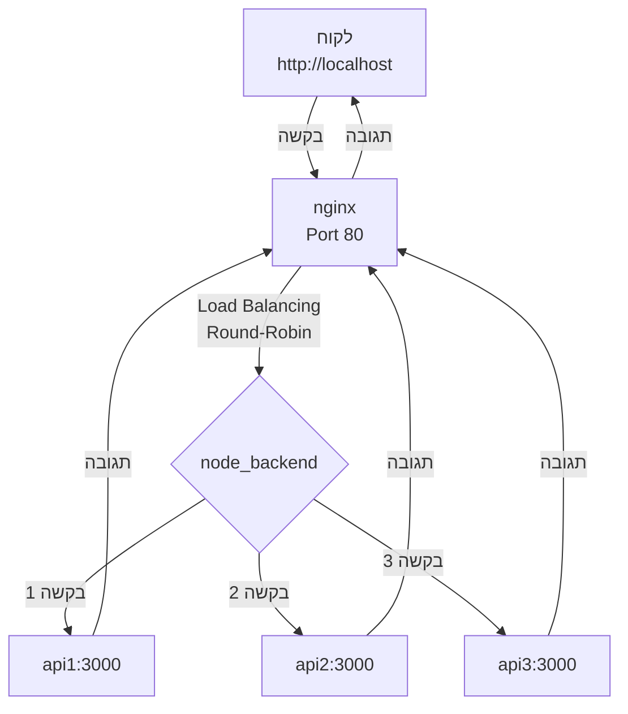

# Shopping List App

A full-stack shopping list management application built with Node.js, Express, and MongoDB. Features a production-ready architecture with load balancing across 3 Node.js server instances using Nginx reverse proxy, ensuring high availability and scalability. Includes comprehensive test coverage with automated CI/CD pipeline via GitHub Actions, JWT-based authentication, and a modern frontend interface. All services are containerized with Docker Compose for easy deployment and development.

## Features

- User registration and authentication (JWT)
- MongoDB database in Docker (custom port 27018)
- Mongo Express for database management
- **Load Balancing with Nginx** - 3 Node.js server instances with automatic request distribution
- High availability - if one server fails, others continue serving requests
- Create multiple shopping lists per user
- Add products to lists
- Update and delete products
- Delete entire shopping lists

## Prerequisites

- Node.js (v14 or higher)
- Docker and Docker Compose
- npm or yarn

## Installation

1. Clone the repository and navigate to the project directory

2. Create a `.env` file from the example:

```bash
cp server/env_example.txt .env
```

3. Update the `.env` file with your configuration (especially JWT_SECRET)

4. Start all services (3 Node.js servers + Nginx + MongoDB):

```bash
npm run dev
```

This command will:

- Build and start **3 Node.js API servers** (api1, api2, api3) for load balancing
- Start **Nginx reverse proxy** on port 80 that distributes requests between the 3 servers
- Start **MongoDB** database on port 27018
- Start **Mongo Express** web interface on port 8081

Access the application at `http://localhost` (Nginx will route requests to the appropriate Node.js server).

## Environment Variables

The `.env` file contains the following variables:

- `PORT` - Server port (default: 3000)
- `MONGO_URI` - MongoDB connection string
- `MONGO_ROOT_USERNAME` - MongoDB root username
- `MONGO_ROOT_PASSWORD` - MongoDB root password
- `MONGO_EXPRESS_USERNAME` - Mongo Express username
- `MONGO_EXPRESS_PASSWORD` - Mongo Express password
- `JWT_SECRET` - Secret key for JWT tokens
- `JWT_EXPIRE` - JWT token expiration time

## API Endpoints

### Authentication

- `POST /api/auth/register` - Register a new user
- `POST /api/auth/login` - Login user
- `GET /api/auth/me` - Get current user (protected)

### Shopping Lists

- `GET /api/shopping-lists` - Get all shopping lists (protected)
- `GET /api/shopping-lists/:id` - Get single shopping list (protected)
- `POST /api/shopping-lists` - Create new shopping list (protected)
- `DELETE /api/shopping-lists/:id` - Delete shopping list (protected)

### Products

- `POST /api/shopping-lists/:listId/products` - Add product to list (protected)
- `PUT /api/shopping-lists/:listId/products/:productId` - Update product (protected)
- `DELETE /api/shopping-lists/:listId/products/:productId` - Delete product (protected)

## Testing

### Automated Tests

The project includes comprehensive unit and integration tests using Jest and Supertest.

**Run tests locally:**

```bash
cd server
npm test
```

**Run tests in watch mode:**

```bash
cd server
npm run test:watch
```

**Run tests for CI (with coverage):**

```bash
cd server
npm run test:ci
```

**Test Coverage:**

- Controllers: Authentication and Shopping List controllers
- Middleware: JWT authentication middleware
- Models: User and Shopping List models
- Tests use MongoDB Memory Server for isolated test database

### Manual API Testing

Use the `request.rest` file with REST Client extension in VS Code, or import it into Postman/Insomnia.

1. First, register a user or login to get a JWT token
2. Copy the token and replace `{{token}}` in the request.rest file
3. Use the list and product IDs from responses to test other endpoints

## Architecture

The application uses a load-balanced architecture with Nginx as a reverse proxy:



### Load Balancing

- **Nginx** acts as a reverse proxy and load balancer on port 80
- **3 Node.js servers** (api1, api2, api3) run on port 3000 internally
- Requests are distributed using **round-robin** algorithm
- All servers share the same MongoDB database
- If one server fails, Nginx automatically routes requests to the remaining servers

## Service Access

- **Application**: `http://localhost` (Nginx load balancer)
- **MongoDB**: `localhost:27018` (custom port to avoid conflict with local MongoDB)
- **Mongo Express**: `http://localhost:8081` (web interface for viewing data)

## Project Structure

```
.
├── client/                   # Frontend files
│   ├── css/
│   ├── js/
│   └── index.html
├── nginx/
│   └── nginx.conf           # Nginx load balancer configuration
├── .github/
│   └── workflows/
│       └── tests.yml            # GitHub Actions CI/CD workflow
├── server/                      # Backend Node.js application
│   ├── config/
│   │   └── database.js          # MongoDB connection
│   ├── controllers/
│   │   ├── authController.js    # Authentication logic
│   │   └── shoppingListController.js  # Shopping list logic
│   ├── middleware/
│   │   └── auth.js              # JWT authentication middleware
│   ├── models/
│   │   ├── User.js              # User model
│   │   └── ShoppingList.js      # Shopping list model
│   ├── routes/
│   │   ├── authRoutes.js        # Authentication routes
│   │   └── shoppingListRoutes.js # Shopping list routes
│   ├── tests/                   # Test files
│   │   ├── controllers/         # Controller tests
│   │   ├── middleware/          # Middleware tests
│   │   ├── models/              # Model tests
│   │   └── setup.js             # Test setup with MongoDB Memory Server
│   ├── Dockerfile               # Node.js server Docker image
│   ├── package.json             # Server dependencies
│   └── server.js                # Main server file
├── .env                       # Environment variables (create from env_example.txt)
├── .gitignore                 # Git ignore file
├── docker-compose.yml         # Docker Compose configuration (3 API servers + Nginx + MongoDB)
├── package.json               # Root dependencies
├── request.rest               # API testing file
└── README.md                  # This file
```

## Notes

- **Load Balancing**: The application runs 3 identical Node.js server instances behind an Nginx reverse proxy
- **Round-Robin Distribution**: Requests are distributed evenly across all 3 servers using round-robin algorithm
- **Shared Storage**: All servers share the same MongoDB database, ensuring data consistency
- **High Availability**: If one server fails, Nginx automatically routes requests to the remaining healthy servers
- **Port Configuration**:
  - Nginx listens on port 80 (main entry point)
  - Node.js servers run on port 3000 internally (not exposed to host)
  - MongoDB uses port 27018 on the host to avoid conflicts with local MongoDB installation
- **Authentication**: JWT tokens are used for authentication
- **Protected Routes**: All shopping list and product routes require authentication

## CI/CD with GitHub Actions

The project includes automated CI/CD pipeline using GitHub Actions.

### Automated Testing

Tests run automatically on:

- Push to `main`, `master`, or `develop` branches
- Pull requests to `main`, `master`, or `develop` branches

**Test Matrix:**

- Tests run on Node.js versions: 18.x and 20.x
- Uses Jest with coverage reporting
- Tests run in isolated MongoDB Memory Server instances
- Coverage reports uploaded to Codecov

**Workflow Features:**

- Automatic test execution on multiple Node.js versions
- Code coverage reporting
- Email notifications on test failures (requires GitHub Secrets configuration)

**GitHub Secrets Required for Email Notifications:**

- `EMAIL_USERNAME` - SMTP username (e.g., Gmail address)
- `EMAIL_PASSWORD` - SMTP password (use Gmail App Password if 2FA is enabled)
- `EMAIL_TO` - Recipient email address
- `EMAIL_FROM` - Sender email address

View workflow file: `.github/workflows/tests.yml`

## Nginx Configuration

The Nginx configuration (`nginx/nginx.conf`) includes:

- Upstream configuration with 3 Node.js backend servers
- Round-robin load balancing (default)
- Proxy headers for proper request forwarding
- WebSocket support for real-time features
- Health check endpoint at `/api/health`
